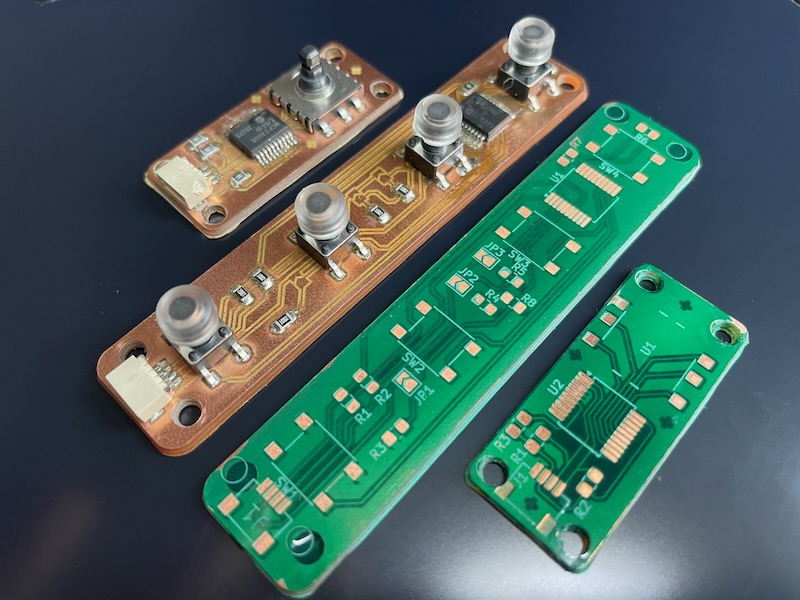

5wayjoy
---

Tactile 5 way joystick used in combination with fingertips as part of micro-chording. A one handed chording keyboard.

An addition I2C hub and controller is used to run the CircuitPython code needed to translate chords into ascii chars.

